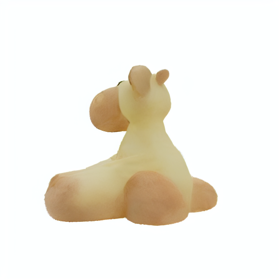
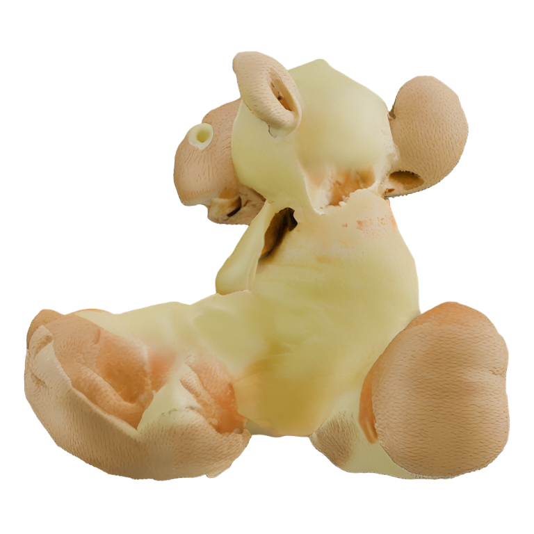

# EDN
The EDN is a plug-and-play module that can be directly embedded into the inference process of the NVS models without any adjustments to the original U-net network architecture.
This repo provides scripts about:

1.  The code for collecting "initial noise-high-quality noise pairs" in [Sv3d-diffusers](https://github.com/chenguolin/sv3d-diffusers)(`sv3d_diffusers_to_collect_noise/infer.py`).

2. [Sv3d-diffusers](https://github.com/chenguolin/sv3d-diffusers) with EDN added(`sv3d_diffusers_with_EDN/infer.py`).

3. The code for collecting "initial noise-high-quality noise pairs" in [Mv-Adapter](https://github.com/huanngzh/MV-Adapter)(`MV-Adapter_to_collect_noise/scripts/inference_i2mv_sdxl.pyy`).

4. [Mv-Adapter](https://github.com/huanngzh/MV-Adapter) with EDN added(`MV-Adapter_with_EDN/scripts/inference_i2mv_sdxl.py`).

5. The training code of EDN for Sv3d-diffusers(`golden_noise_net_for_sv3d/train.py`).

6. The training code of EDN for Mv-Adapter(`golden_noise_net_for_mvadapter/train.py`).

## 🚀 Usage
##  Sv3d 
```bash
# Please install PyTorch first according to your CUDA version
pip3 install -r requirements_for_sv3d.txt
```
If you want to train the EDN for Sv3d-diffusers, you need to run the train.py in folder golden_noise_net_for_sv3d.
```bash
python train.py
```
If you want to collect "initial noise-high-quality noise pairs" in Sv3d-diffusers, you need to run the infer.py in folder sv3d_diffusers_to_collect_noise.
```bash
python infer.py
```
If you want to view the results of Sv3d-diffusers with EDN added, you need to run the infer.py in folder sv3d_diffusers_with_EDN.
```bash
python infer.py
```
##  Mv-Adapter 
```bash
# Please install PyTorch first according to your CUDA version
pip3 install -r requirements_for_mvadapter.txt
```
If you want to train the EDN for Mv-Adapter, you need to run the train.py in folder golden_noise_net_for_mvadapter.
```bash
python train.py
```
If you want to collect "initial noise-high-quality noise pairs" in Mv-Adapter, you need to run the infer.py in folder `MV-Adapter_to_collect_noise/scripts.
```bash
python inference_i2mv_sdxl.py
```
If you want to view the results of Mv-Adapter with EDN added, you need to run the infer.py in folder MV-Adapter_with_EDN/scripts.
```bash
python inference_i2mv_sdxl.py
```
## 📸 Results
> Image preprocessing and random seed for different implementations are different, so the results are presented only for reference.

| model |  |     |  |
| :------------- | :------:  | :----: | :----: |
| **GT** |  |  |  |
| **Official SV3D-diffusers** |  |  |  |
| **SV3D-diffusers with EDN**  |  |  |  |
| **Official Mv-Adapter** |  |  |  |
| **Mv-Adapter with EDN**  |  |  |  |
